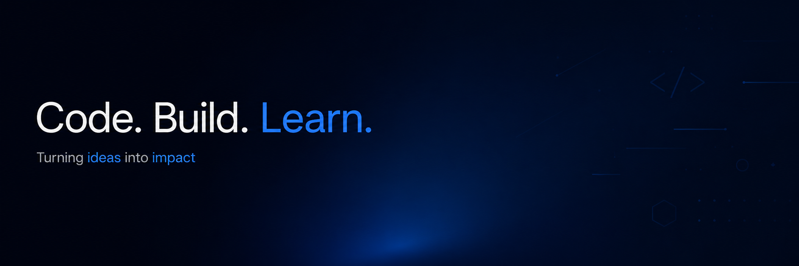

  

  
  
  
   

## About

I'm a Backend Developer and AI/ML enthusiast, passionate about building efficient, scalable, and data-driven applications. I recently completed my Master of Computer Applications (MCA) with a 9.08 GPA, and I love turning complex problems into clean, well-structured code.

My core focus is **backend engineering** — designing robust APIs, working with databases, and building systems that scale — while also exploring the intersection of backend development and **Artificial Intelligence / Machine Learning**.

I'm mainly interested in:
- **Backend Development** — Building REST APIs and server-side applications using **Django REST Framework** and **FastAPI**
- **Databases & SQL** — Writing optimized queries, designing normalized schemas, and improving database performance
- **Snowflake** — Exploring cloud data warehousing and working with large-scale data storage and analytics
- **AI & Machine Learning** — Exploring predictive modeling, data pipelines, and applied AI, including Retrieval-Augmented Generation (RAG) systems

##  Experience

- **AI/ML Intern — CodeLab Systems** (Dec 2024 – Feb 2025)
  Worked on Artificial Intelligence and Machine Learning tasks, including data preprocessing, model development, and evaluation.

## Projects

- **Cocoa Butter Quality Prediction** — A machine learning model built with Python and Scikit-learn to classify cocoa butter quality. Used SHAP for feature-importance analysis and was selected for the KSCST State-Level Project Exhibition.

- **Real Estate Booking Management System** — A Django web app for managing property listings, bookings, and enquiries. Includes user/realtor registration, rental agreements, and visit scheduling.

- **Metabolic Syndrome Detection** — Logistic Regression and Random Forest models to detect metabolic syndrome from health data. Deployed as APIs using Flask and FastAPI.

- **RAG-Powered Project Intelligence Assistant** — An AI document assistant using RAG, FAISS, and LangChain for semantic search. Answers are generated via the Groq LLM API, with a Streamlit interface.

- **Automatic Tollgate System** — An automated toll system that detects vehicles and controls the gate without manual intervention. Built using sensor/RFID-based detection and gate control logic.

## Skills
**Languages & Web**: Python, SQL, HTML, CSS, JavaScript

**Frameworks:** Django, Django REST Framework, FastAPI, Flask

**Databases:** MySQL, Oracle SQL, Snowflake

**Tools:** VS Code, Git, GitHub, Postman, Jupyter Notebook

**AI/ML & Data:** Scikit-learn, Pandas, Matplotlib, SHAP, LangChain, FAISS, Streamlit

 ## Education

**Master of Computer Applications (MCA)** — GPA: 9.08
 
Vivekananda College of Engineering and Technology, Puttur | Dec 2023 – Sep 2025
 
 
**Bachelor of Science (B.Sc)** — GPA: 8.02
 
Vivekananda College of Arts, Science and Commerce, Puttur | Jun 2020 – Aug 2023

 ## Contact

 

**Phone:** +91 96064 98369
 
**Email:** sharanyabaleguli@gmail.com
 
**GitHub:** https://www.github.com/sharanyabaleguli
 
**LinkedIn:** https://www.linkedin.com/in/sharanya-b-b6b640342
 
**Portfolio:** https://sharanyabaleguli.github.io/Portfoli/

